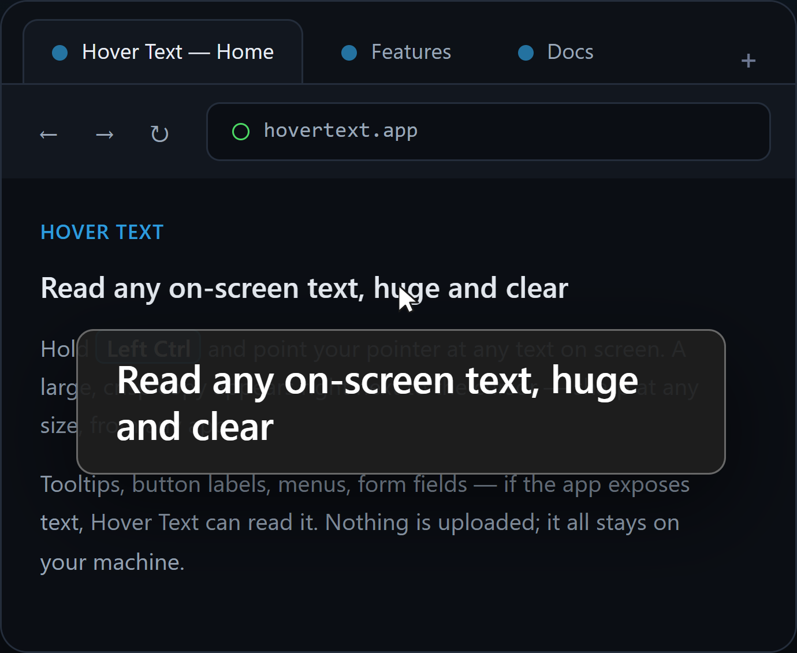
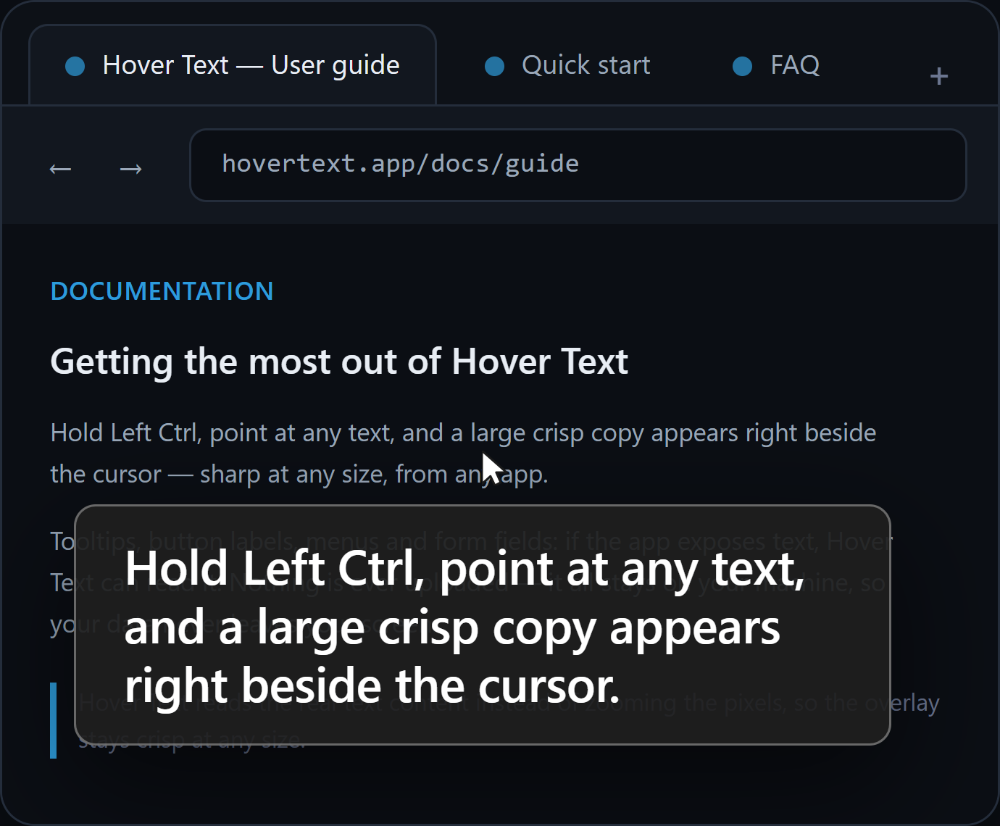

# Hover Text

[](https://github.com/Kmg11/HoverText/blob/main/LICENSE)

A Windows accessibility tool.
Hold a modifier key, point at any text on screen, and see it rendered large
in a floating overlay — using the real text content (via UI Automation),
not a blurry pixel zoom.

Visit the landing page at **<https://Kmg11.github.io/HoverText/>**.

## Screenshots





## How it works

1. `KeyboardHook.cs` installs a global low-level keyboard hook and fires
   `KeyDown`/`KeyUp` when **Left Ctrl** (the default trigger) is
   pressed/released.
2. While held, `App.xaml.cs` polls the cursor position every ~60ms
   (`GetCursorPos`).
3. `ElementTextExtractor.cs` asks Windows UI Automation (via the
   [FlaUI](https://github.com/FlaUI/FlaUI) wrapper) what element is at that
   point, and pulls its text — trying `TextPattern`, then `ValuePattern`,
   then the accessible `Name`, then `HelpText`, in that order.
4. `OverlayWindow.xaml` shows that text in a large, borderless, click-through,
   always-on-top popup near the cursor.
5. A tray icon lets you see it's running and exit.

This re-renders the actual text content, rather than screen-zooming like
Windows Magnifier does — so text stays crisp at any size.

## Requirements

- Windows 10 or 11
- [.NET 10 SDK](https://dotnet.microsoft.com/download)
- Visual Studio 2026 (recommended) or just the `dotnet` CLI
- Internet access to restore the FlaUI NuGet packages on first build

## Build & run

**Visual Studio:** open the folder, let it restore NuGet packages, press F5.

**CLI:**

```
dotnet restore
dotnet run
```

There's no visible main window — check the system tray for the icon once
it's running.

## Installer (Inno Setup)

The repo ships a per-user installer (`installer/installer.iss`) that installs
the app to `%LocalAppData%\Programs\HoverText`, adds a Start Menu shortcut,
registers it in **Settings → Apps → Installed apps** for uninstall, and offers
a "Launch with Windows" install-time checkbox.

Build it locally (needs [Inno Setup](https://jrsoftware.org/isinfo.php), e.g.
`winget install JRSoftware.InnoSetup`):

```
dotnet publish HoverText.csproj -c Release -r win-x64 --self-contained false -p:PublishSingleFile=true -p:IncludeNativeLibrariesForSelfExtract=true -o bin/Release/publish
"C:\Users\<you>\AppData\Local\Programs\Inno Setup 6\ISCC.exe" installer\installer.iss /DAppVersion=1.0.0
```

Output: `bin\Release\installer\HoverTextSetup-<version>.exe`.

GitHub Actions builds and attaches the installer to every `v*` release tag.

## Usage

1. Launch the app (tray icon appears).
2. Hold **Left Ctrl** and move your mouse over any text — button labels,
   paragraphs, tooltips, menu items, form fields.
3. Release Left Ctrl to hide the popup.
4. Right-click the tray icon → **Options...** to tweak behavior, or
   **Exit** to quit.

## Options

Right-click the tray icon → **Options...**. Every change applies immediately
and is saved to `%LocalAppData%\HoverText\settings.json`.

- **Trigger keys** — click **Change...** and press any key or chord you want
  to hold (e.g. Left Ctrl, Ctrl+Shift). Enter finishes, Esc cancels.
  Re-applied live.
- **Font size / Max width / Gap below cursor** — overlay sizing and how far
  it sits from the pointer.
- **Theme** — Dark (default) or Light.
- **Keep overlay anchored over the same text** — on (default): the popup
  stays put while the text under the cursor is unchanged. Off: it always
  re-centers under the cursor.
- **Copy hovered text to clipboard on release** — release the trigger to
  copy whatever text was last shown.
- **Launch at startup** — registers/unregisters the app under
  `HKCU\...\CurrentVersion\Run`.

Anything not exposed in the options window still lives in `Config.cs`:

- `Config.cs` — every tunable constant (trigger key, poll interval, overlay
  size, offsets, max text length). Change knobs here, not in the logic files.

## Known limitations (this is an MVP, not full parity)

- **Electron/Chromium apps** (Slack, Discord, VS Code, most browsers) often
  need accessibility support explicitly enabled by the app, and even then
  expose a thinner tree than native apps — expect inconsistent results.
- **Canvas-rendered UI** (games, some custom-drawn apps) exposes no
  accessible text at all via UIA. A real fix would add an OCR fallback
  (e.g. Windows' built-in `Windows.Media.Ocr`) when UIA comes back empty —
  not implemented here.
- **Elevated (Admin) apps**: Windows blocks non-elevated processes from
  inspecting elevated ones. If you need this to work over an app running
  as Administrator, run Hover Text as Administrator too.
- No triple-press "lock" mode (toggle without holding the key down) —
  straightforward to add to `KeyboardHook` if wanted.
- Font/weight/color of the _original_ text isn't preserved — UIA gives you
  the string content, not its original styling, so everything renders in
  the overlay's own font.
- No pointer-based color picker — could be added by sampling the pixel
  under the cursor with `GetPixel`.

## A note on testing

This is an MVP with no automated tests; verification is "it compiles and
runs". UIA quirks vary wildly across apps, so if you hit an app that yields
no text, the likely culprits are FlaUI pattern access or an app that doesn't
expose its UI tree.

## License

Released under the [MIT License](LICENSE).
